+++
Categories = ["Development", "Python", "USCL"]
Description = "matplotlib is a plotting library for the Python programming language and its numerical mathematics extension NumPy."
Tags = ["Development", "Python", "USCL"]
author = "Mohit Sharma"
date = "2015-08-04T01:20:20-04:00"
title = "Python_Matplotlib"

+++

<h1 align='center'>Matplotlib</h1>

> Disclaimer: This tutorial is heavily inspired from 

> - Benjamin Root's Anatomy of Matplotlib

> - Eric Jones' SciPy 2012 tutorial

> - Nicolas Rougier's Matplotlib tutorial

> - Matplotlib Gallery

> A lot of the content has been taken directly/ indirectly from these tutorials since it couldn't have been made more simpler than the collaborative result of these hardworking people.


Matplotlib is probably the single most used Python package for 2D-graphics. It provides both a very quick way to visualize data from Python and publication-quality figures in many formats. We are going to explore matplotlib in interactive mode covering most common cases.
The matplotlib code is conceptually divided into three parts: the `pylab` interface is the set of functions provided by `matplotlib.pylab` which allow the user to create plots with code quite similar to `MATLAB` figure generating code. The matplotlib frontend or matplotlib API is the set of classes that do the heavy lifting, creating and managing figures, text, lines, plots and so on. This is an abstract interface that knows nothing about output. The backends are device-dependent drawing devices, aka renderers, that transform the frontend representation to hardcopy or a display device.

### `Backends?`
Matplotlib has multiple backends. The backends allow mpl to be used on a variety of platforms with a variety of GUI toolkits ([`GTK`](http://www.gtk.org/ 'GTK'), [`Qt`](http://www.qt.io/ 'Qt'), [`WxWidgets`](https://www.wxwidgets.org/ 'WxWidgets'), etc.), all of them written so that most of the time, you will not need to care which backend you are using. However, bugs do occur, and so two of the most important pieces of information you can provide in a bug report is which version of matplotlib, and which backend.

## Gallery
Many users of matplotlib are often faced with the question, "I want to make a plot that has X with Y in the same figure, but it needs to look like Z". Good luck getting an answer from a web search with that query. This is why the [`Gallery`](http://matplotlib.org/gallery.html "Matplotlib Gallery") is so useful, because it showcases the variety of ways one can make plots. Browse through the gallery, click on any figure that has pieces of what you want to see the code that generated it. Soon enough, you will be like a chef, mixing and matching components to produce your masterpiece!


    import matplotlib
    print(matplotlib.__version__)
    print(matplotlib.get_backend())

    1.4.3
    MacOSX


# Lets Begin!
Matplotlib is a large project and can seem daunting at first. However, by learning the components, it should begin to feel much smaller and more approachable.

We start with the most important import statements you will ever need for matplotlib


    import numpy as np
    import matplotlib.pyplot as plt
    %matplotlib inline

# pyplot
The pyplot module is where everything in matplotlib comes together. It is the launching point for 

- preparing your figures, 
- making plots, and 
- doing any modifications and decorations you want. 

It all comes together here. Let us take a look at those three catagories of pyplot functions.

## Plotting Preparation

Function          | Description                                                                                
:-----------------|:----------------------------------------------------------
`autoscale`       | Autoscale the axis view to the data (toggle).
`axes`            | Add an axes to the figure.                                                                 
`axis`            | Convenience method to get or set axis properties.
`cla`             | Clear the current axes.                                                                    
`clf`             | Clear the current figure.                                                                  
`clim`            | Set the color limits of the current image.                                                 
`delaxes`         | Remove an axes from the current figure.                                                    
`locator_params`  | Control behavior of tick locators.                                                         
`margins`         | Set or retrieve autoscaling margins.
`figure`          | Creates a new figure.                                                                      
`gca`             | Return the current axis instance.                                                          
`gcf`             | Return a reference to the current figure.                                                  
`gci`             | Get the current colorable artist.                                                          
`hold`            | Set the hold state.                                                                        
`ioff`            | Turn interactive mode off.                                                                 
`ion`             | Turn interactive mode on.                                                                  
`ishold`          | Return the hold status of the current axes.                                                
`isinteractive`   | Return status of interactive mode.                                                         
`rc`              | Set the current rc params.                                                                 
`rc_context`      | Return a context manager for managing rc settings.                                         
`rcdefaults`      | Restore the default rc params.                                                             
`savefig`         | Save the current figure.                                                                   
`sca`             | Set the current Axes instance.                                                     
`sci`             | Set the current image.                                                                     
`set_cmap`        | Set the default colormap
`setp`            | Set a property on an artist object
`show`            | Display a figure
`subplot`         | Return a subplot axes positioned by the given grid definition.                             
`subplot2grid`    | Create a subplot in a grid.                                                                
`subplot_tool`    | Launch a subplot tool window for a figure.                                                 
`subplots`        | Create a figure with a set of subplots already made.                                       
`subplots_adjust` | Tune the subplot layout.                                                                   
`switch_backend`  | Switch the default backend.                                                                
`tick_params`     | Change the appearance of ticks and tick labels.                                            
`ticklabel_format`| Change the ScalarFormatter used by default for linear axes.           
`tight_layout`    | Automatically adjust subplot parameters to give specified padding.                         
`xkcd`            | Turns on [XKCD](http://xkcd.com/) sketch-style drawing mode.                             
`xlabel`          | Set the *x* axis label of the current axis.                                                
`xlim`            | Get or set the *x* limits of the current axes.                                             
`xscale`          | Set the scaling of the *x*-axis.                                                           
`xticks`          | Get or set the *x*-limits of the current tick locations and labels.                        
`ylabel`          | Set the *y* axis label of the current axis.                                                
`ylim`            | Get or set the *y*-limits of the current axes.                                             
`yscale`          | Set the scaling of the *y*-axis.                                                           
`yticks`          | Get or set the *y*-limits of the current tick locations and labels.                        

## Plotting Functions

Function          | Description
:-----------------|:--------------------------------------------
`acorr`           | Plot the autocorrelation of *x*
`bar`             | Make a bar plot
`barbs`           | Plot a 2-D field of barbs
`barh`            | Make a horizontal bar plot
`boxplot`         | Make a box and whisker plot
`broken_barh`     | Plot horizontal bars
`cohere`          | Plot the coherence between *x* and *y*
`contour`         | Plot contours
`contourf`        | Plot filled contours
`csd`             | Plot cross-spectral density
`errorbar`        | Plot an errorbar graph
`eventplot`       | Plot identical parallel lines at specific positions
`fill`            | Plot filled polygons
`fill_between`    | Make filled polygons between two curves
`fill_betweenx`   | Make filled polygons between two horizontal curves
`hexbin`          | Make a hexagonal binning plot
`hist`            | Plot a histogram
`hist2d`          | Make a 2D histogram plot
`imshow`          | Display an image on the axes
`loglog`          | Make a plot with log scaling on both the *x* and *y* axis
`matshow`         | Display an array as a matrix in a new figure window
`pcolor`          | Create a pseudocolor plot of a 2-D array
`pcolormesh`      | Plot a quadrilateral mesh
`pie`             | Plot a pie chart
`plot`            | Plot lines and/or markers
`plot_date`       | Plot with data with dates
`polar`           | Make a polar plot
`psd`             | Plot the power spectral density
`quiver`          | Plot a 2-D field of arrows
`scatter`         | Make a scatter plot of x vs y
`semilogx`        | Make a plot with log scaling on the *x* axis 
`semilogy`        | Make a plot with log scaling on the *y* axis
`specgram`        | Plot a spectrogram
`spy`             | Plot the sparsity pattern on a 2-D array
`stackplot`       | Draws a stacked area plot
`stem`            | Create a stem plot
`step`            | Make a step plot
`streamplot`      | Draws streamlines of a vector flow
`tricontour`      | Draw contours on an unstructured triangular grid
`tricontourf`     | Draw filled contours on an unstructured triangular grid
`tripcolor`       | Create a pseudocolor plot of an unstructured triangular grid
`triplot`         | Draw a unstructured triangular grid as lines and/or markers
`xcorr`           | Plot the cross-correlation between *x* and *y*

## Plot modifiers

Function          | Description                                                                                
:-----------------|:---------------------------------------------------------------------
`annotate`        | Create an annotation: a piece of text referring to a data point
`arrow`           | Add an arrow to the axes
`axhline`         | Add a horizontal line across the axis
`axhspan`         | Add a horizontal span (rectangle) across the axis
`axvline`         | Add a vertical line across the axes
`axvspan`         | Add a vertical span (rectangle) across the axes
`box`             | Turn the axes box on or off
`clabel`          | Label a contour plot
`colorbar`        | Add a colorbar to a plot
`grid`            | Turn the axes grids on or off
`hlines`          | Plot horizontal lines
`legend`          | Place a legend on the current axes
`minorticks_off`  | Remove minor ticks from the current plot
`minorticks_on`   | Display minor ticks on the current plot
`quiverkey`       | Add a key to a quiver plot
`rgrids`          | Get or set the radial gridlines on a polar plot
`suptitle`        | Add a centered title to the figure
`table`           | Add a table to the current axes
`text`            | Add text to the axes
`title`           | Set a title of the current axes
`vlines`          | Plot vertical lines
`xlabel`          | Set the *x* axis label of the current axis
`ylabel`          | Set the *y* axis label of the current axis

####**Enough! **

####**That's Enough tables and theory.** Let's actually plot something...

## Figure
### Introduction
All plotting is done through the [`Figure`](http://matplotlib.org/api/figure_api.html#matplotlib.figure.Figure) object. You can create as many figures as you need. Figures can't do much by themselves, but no plotting can happen without them. They are, literally, the "canvas" of your plot.


    fig = plt.figure()


    <matplotlib.figure.Figure at 0x102f4b710>


Ha! nothing happened! This is because by default mpl will not show anything until told to do so. In other words, the "interactive mode" is turned off. This is very useful for scripting where we would not ever want to see the intermediate results. For those who wishes to experiment and want to see their plot as they issue commands, there is the "`plt.ion()`" command they can issue before creating their first figure of their session. For the purpoase of this tutorial, we will leave interactivity off.

### Figure properties
* figsize : tuple of integers, width, height in inches.
    
* dpi : integer, esolution of the figure in dots per inch.


    fig = plt.figure(figsize=(10, 4))
    fig.gca()  # needed for the ipython-inline to display anything. This returns the current axis instance.
    plt.show() # Lets see the plot (Nothin special.. just axis and a white canvas!)


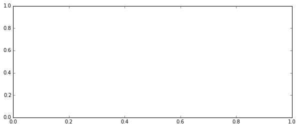


A really useful utility function is [`figaspect`](http://matplotlib.org/api/figure_api.html?highlight=figaspect#matplotlib.figure.figaspect)

This lets you create a figure with specified aspect ratio. If arg is a number, use that aspect ratio. If arg is an array, figaspect will determine the width and height for a figure that would fit array preserving aspect ratio.


    # Twice as wide. Ratio of Height/ Width
    fig = plt.figure(figsize=plt.figaspect(0.5))
    fig.gca()
    plt.show()


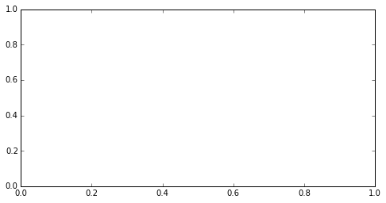


## Axes
From above output we can observe that Matplotlib automatically creates axis for us. mpl gives us an option to change the axes. (Obviously since All plotting is done with respect to an [`Axes`](http://matplotlib.org/api/axes_api.html#matplotlib.axes.Axes)). 

An *Axes* is made up of [`Axis`](http://matplotlib.org/api/axis_api.html#matplotlib.axis.Axis) objects (and many other things). An *Axes* object must belong to a *Figure* (and only one `Figure`). Most commands you will ever issue will be with respect to this *Axes* object.


    # Lets manually add axis for x axis
    fig = plt.figure()
    '''
    fig.add_subplot(numrows numcols fignum). subplot(111) will be created by default 
    if you don't manually specify axes. fignum ranges from 1 to numrows*numcols.
    If you want to place an axes manually, i.e., not on a rectangular grid, use the axes() command, 
    which allows you to specify the location as axes([left, bottom, width, height]) where all values 
    are in fractional (0 to 1) coordinates. 
    Each figure can contain as many axes and subplots as your heart desires
    '''
    ax = fig.add_subplot(111) 
    ax.plot([1, 2, 3, 4, 5, 6, 7, 8], np.random.randint(1, 99, size=(1,8))[0])  # Add some data for X and Y
    ax.set_xlim(0.5, 8.5) # Set X axis between 0.5 and 8.5
    plt.show()


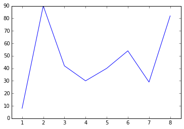


All methods of an `Axes` object exist as a function in the *pyplot* module (and vice-versa). For example, when calling `plt.xlim(1, 10)`, `pyplot` calls `ax.set_xlim(1, 10)` on whichever `Axes` is "current". Here is an equivalent version of the above example using just pyplot.


    plt.plot([1, 2, 3, 4, 5, 6, 7, 8], np.random.randint(1, 99, size=(1,8))[0])  # Add some data for X and Y
    plt.xlim(0.5, 8.5)
    plt.show()


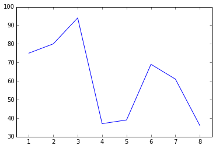


Much cleaner Code, right? So, why will most of my examples not follow the pyplot approach? Because [`PEP20`](http://www.python.org/dev/peps/pep-0020/) "The Zen of Python" says:

"`Explicit is better than implicit`"

While very simple plots, with short scripts would benefit from the conciseness of the pyplot implicit approach, when doing more complicated plots, or working within larger scripts, you will want to explicitly pass around the `Axes` and/or `Figure` object to operate upon.

### Limits and autoscaling
As mentioned above, by default, matplotlib will attempt to determine limits for you that encompasses all the data you have plotted.  This is the "autoscale" feature. For line and image plots, the limits are not padded, while plots such as scatter plots and bar plots are given some padding.


    fig, (ax1, ax2) = plt.subplots(1, 2, figsize=plt.figaspect(0.5))
    ax1.plot([-10, -5, 0, 5, 10, 15], [-1.2, 2, 3.5, -0.3, -4, 1]) # Will not pad
    ax2.scatter([-10, -5, 0, 5, 10, 15], [-1.2, 2, 3.5, -0.3, -4, 1]) # Will pad
    plt.show()


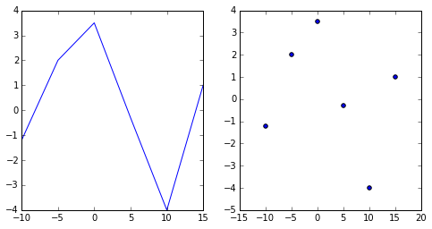


> A trick with limits is to specify only half of a limit. When done **after** a plot is made, this has the effect of allowing the user to anchor a limit while letting matplotlib to autoscale the rest of it.

Take a look at below example to understand what I mean


    # Good -- setting limits after plotting is done
    fig, (ax1, ax2) = plt.subplots(1, 2, figsize=plt.figaspect(0.5))
    ax1.plot([-10, -5, 0, 5, 10, 15], [-1.2, 2, 3.5, -0.3, -4, 1])
    ax2.scatter([-10, -5, 0, 5, 10, 15], [-1.2, 2, 3.5, -0.3, -4, 1])
    ax1.set_ylim(bottom=-10)
    ax2.set_xlim(right=25)
    plt.show()


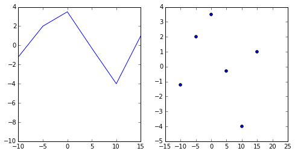


    # Bad -- Setting limits before plotting is done
    fig, (ax1, ax2) = plt.subplots(1, 2, figsize=plt.figaspect(0.5))
    ax1.set_ylim(bottom=-10) # This will mess up your plot
    ax2.set_xlim(right=25)  # This will mess up your plot
    ax1.plot([-10, -5, 0, 5, 10, 15], [-1.2, 2, 3.5, -0.3, -4, 1])
    ax2.scatter([-10, -5, 0, 5, 10, 15], [-1.2, 2, 3.5, -0.3, -4, 1])
    plt.show()


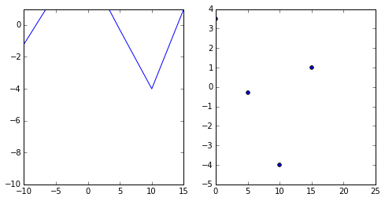


### Labels and Legends
You can label just about anything in mpl. You can provide a label to your plot, which allows your legend to automatically build itself. The X and Y axis can also be labeled, as well as the subplot itself via the title.


    fig = plt.figure()
    ax = fig.add_subplot(111)
    ax.plot([1, 2, 3, 4], np.random.randint(1, 99, size=(1,4))[0], label='Philadelphia')
    ax.plot([1, 2, 3, 4], np.random.randint(1, 99, size=(1,4))[0], label='Boston')
    ax.set_ylabel('Temperature (deg C)')
    ax.set_xlabel('Time')
    ax.set_title("A tale of two cities")
    ax.legend()
    plt.show()


Also, if you happen to be plotting something that you do not want to appear in the legend, just set the label to "\_`nolegend`\_".


    fig, ax = plt.subplots(1, 1)
    ax.bar([1, 2, 3, 4], [10, 20, 25, 30], label="Bar")
    ax.plot([1, 2, 3, 4], [10, 20, 25, 30], label="_nolegend_")  # __nolengend__ is equivalent to not specifying any lengend      
    ax.set_ylim(top=35)
    ax.legend()
    plt.show()


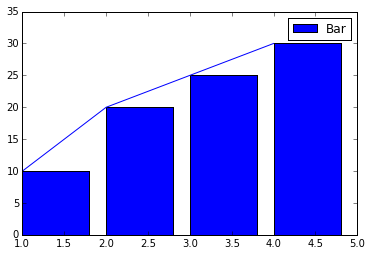


### Ticks, Tick Lines, Tick Labels and Tickers 

* A Tick is the location of a Tick Label.
* A Tick Line is the line that denotes the location of the tick.
* A Tick Label is the text that is displayed at that tick.
* A [`Ticker`](http://matplotlib.org/api/ticker_api.html#module-matplotlib.ticker) automatically determines the ticks for an Axis and formats the tick labels.

[`tick_params()`](http://matplotlib.org/api/axes_api.html#matplotlib.axes.Axes.tick_params) is often used to help configure your tickers.


    fig = plt.figure()
    ax = fig.add_subplot(111)
    ax.plot([1, 2, 3, 4], [10, 20, 25, 30])
    ax.xaxis.set_ticks(range(1, 5))               # Set ticks at 1, 2, 3, 4
    ax.xaxis.set_ticklabels([3, 100, -12, "foo"]) # Label ticks as "3", "100", "-12", and "foo"
    ax.tick_params(axis='y', direction='inout', length=10)
    plt.show()


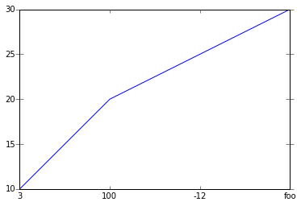


## Subplots
While an `Axes` object can only belong to one `Figure` (and it **MUST**), A `Figure` can have many `Axes` objects. These are typically called "subaxes" or "subplots". They act just like regular `Axes`.


    fig = plt.figure(figsize=(10, 5))
    ax = fig.add_subplot(121)
    ax.plot([1, 2, 3, 4], np.random.randint(1, 99, size=(1,4))[0], label='Philadelphia')
    ax.plot([1, 2, 3, 4], np.random.randint(1, 99, size=(1,4))[0], label='Boston')
    ax.set_title('A tale of two cities')
    ax.legend()
    
    t = np.linspace(-np.pi, np.pi, 256, endpoint=True)
    z = np.sin(t)
    ax = fig.add_subplot(122)
    plt.xticks([-np.pi, -np.pi/2, 0, np.pi/2, np.pi])
    ax.plot(t, z, label='Sine Wave')
    ax.set_title("Observed Tide")
    ax.legend()
    
    fig.suptitle('Figure Title')  # Add a centered title for the whole figure
    plt.show()


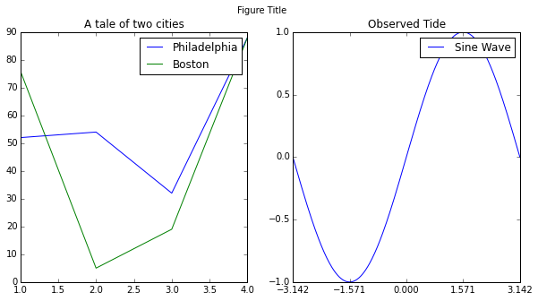


There are many ways to add and modify subplots in a figure.

* [`plt.subplots()`](http://matplotlib.org/api/pyplot_api.html#matplotlib.pyplot.subplots)
* [`plt.subplot()`](http://matplotlib.org/api/pyplot_api.html#matplotlib.pyplot.subplot) and [`fig.add_subplot()`](http://matplotlib.org/api/figure_api.html?#matplotlib.figure.Figure.add_subplot)  Which should be familiar to all Matlab users
* [`plt.axes()`](http://matplotlib.org/api/pyplot_api.html?#matplotlib.pyplot.axes)
* [`plt.subplot2grid()`](http://matplotlib.org/api/pyplot_api.html?#matplotlib.pyplot.subplot2grid)
* `plt.subplot_tool()` Interactive modification of subplot spacing.

### Spacing
The spacing between the subplots can be adjusted using [`plt.subplots_adjust()`](http://matplotlib.org/api/pyplot_api.html?#matplotlib.pyplot.subplots_adjust). 

Play around with the example below to see how the different arguments affect the spacing.


    fig, axes = plt.subplots(2, 2, figsize=(9, 9))
    plt.subplots_adjust(wspace=0.5, hspace=0.3,
                        left=0.125, right=0.9,
                        top=0.9,    bottom=0.1)
    plt.show()


A common complaint with matplotlib users is that the labels do not fit with the subplots, or the label of one subplot spills onto another subplot's area. Matplotlib does not currently have any sort of robust layout engine, as it is a design decision to minimize the amount of "magic" that matplotlib performs. We intend to let users have complete, 100% control over their plots. LaTeX users would be quite familiar with the amount of frustration that can occur with placement of figures in their documents.

That said, there have been some efforts to develop tools that users can use to help address the most common compaints. The [`Tight Layout`](http://matplotlib.org/users/tight_layout_guide.html) feature, when invoked, will attempt to resize margins, and subplots so that nothing overlaps.


    def example_plot(ax):
        ax.plot([1, 2])
        ax.set_xlabel('x-label', fontsize=10)
        ax.set_ylabel('y-label', fontsize=10)
    
    fig, ((ax1, ax2), (ax3, ax4)) = plt.subplots(nrows=2, ncols=2)
    example_plot(ax1)
    example_plot(ax2)
    example_plot(ax3)
    example_plot(ax4)
    #plt.tight_layout()
    plt.show()  # Check x label, y label 


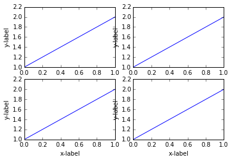


As a last bit of an FAQ, this `tight_layout` feature is unrelated to the so-called `bbox_inches='tight'` feature that will be discussed separately. (Check Sine and Cosine plots below)

### GridSpec
Under the hood, matplotlib utilizes [`GridSpec`](http://matplotlib.org/api/gridspec_api.html) to lay out the subplots. While `plt.subplots()` is fine for simple cases, sometimes you will need more advanced subplot layouts. In such cases, you should use GridSpec directly. GridSpec is outside the scope of this tutorial, but it is handy to know that it exists. [`GridSpec Guide`](http://matplotlib.org/users/gridspec.html) is a guide on how to use it.

### Sharing axes
There will be times when you want to have the x axis and/or the y axis of your subplots to be "shared". Sharing an axis means that the axis in one or more subplots will be tied together such that any change in one of the axis changes all of the other shared axes. This works very nicely with autoscaling arbitrary datasets that may have overlapping domains. Furthermore, when interacting with the plots (panning and zooming), all of the shared axes will pan and zoom automatically.


    fig, (ax1, ax2) = plt.subplots(1, 2, sharex=True, sharey=True)  # Common X and Y axis for both subplots
    ax1.plot([1, 2, 3, 4], [1, 2, 3, 4])
    ax2.plot([3, 4, 5, 6], [6, 5, 4, 3])
    plt.show()


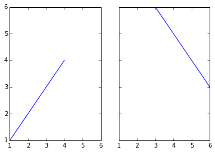


### "Twinning" axes
Sometimes one may want to overlay two plots on the same axes, but the scales may be entirely different. You can simply treat them as separate plots, but then twin them.


    fig, ax1 = plt.subplots(1, 1)
    ax1.plot([1, 2, 3, 4], [1, 2, 3, 4])  # A plot with X and Y values
    ax2 = ax1.twinx()  # Twin X
    ax2.scatter([1, 2, 3, 4], [60, 50, 40, 30])  # Another plot with SAME X but different Y values
    ax1.set_xlabel('X')
    ax1.set_ylabel('First scale')
    ax2.set_ylabel('Other scale')
    plt.show()


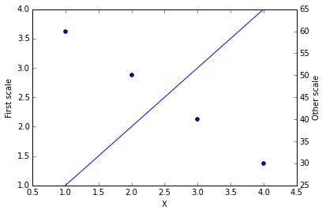


    # A better Twinx example:
    fig, ax1 = plt.subplots()
    t = np.arange(0.01, 10.0, 0.01)
    s1 = np.exp(t)
    ax1.plot(t, s1, 'b-')
    ax1.set_xlabel('time (s)')
    # Make the y-axis label and tick labels match the line color.
    ax1.set_ylabel('exp', color='b')
    for tl in ax1.get_yticklabels():
        tl.set_color('b')
    
    
    ax2 = ax1.twinx()
    s2 = np.sin(2*np.pi*t)
    ax2.plot(t, s2, 'r.')
    ax2.set_ylabel('sin', color='r')
    for tl in ax2.get_yticklabels():
        tl.set_color('r')
    plt.show()


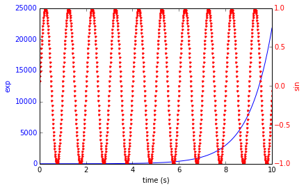


# Axis Spines
Spines are the axis lines for a plot. Each plot can have four spines: "top", "bottom", "left" and "right". By default, they are set so that they frame the plot, but they can be individually positioned and configured via the [`set_position()`](http://matplotlib.org/api/spines_api.html#matplotlib.spines.Spine.set_position) method of the spine. Here are some different configurations.


    fig, ax = plt.subplots(1, 1)
    ax.plot([-2, 2, 3, 4], [-10, 20, 25, 5])
    ax.spines['top'].set_visible(False)
    ax.xaxis.set_ticks_position('bottom')  # no ticklines at the top
    ax.spines['right'].set_visible(False)
    ax.yaxis.set_ticks_position('left')  # no ticklines on the right
    
    # "outward"
    # Move the two remaining spines "out" away from the plot by 10 points
    ax.spines['bottom'].set_position(('outward', 10))
    ax.spines['left'].set_position(('outward', 10))
    
    # "data"
    # Have the spines stay intersected at (0,0)
    #ax.spines['bottom'].set_position(('data', 0))
    #ax.spines['left'].set_position(('data', 0))
    
    # "axes"
    # Have the two remaining spines placed at a fraction of the axes
    #ax.spines['bottom'].set_position(('axes', 0.75))
    #ax.spines['left'].set_position(('axes', 0.25))
    
    plt.show()


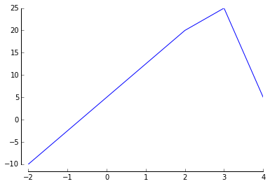


## Colorbars
Let's look at something cool now.


Colorbars are much like legends because they help to describe the data being displayed. While legends describe plots, i.e., plot(), scatter(), hist(), stem(), colorbars describe images. To be really specific and technical, they can be used for any "ScalarMappable", which will be discussed in the `Artists` section. Let us take a look at a very simple example of a colorbar for a simple 2D image.


    y, x = np.ogrid[-6:6:20j, -10:10:30j]
    z = np.hypot(x, y)
    plt.imshow(z)
    plt.colorbar()
    plt.show()


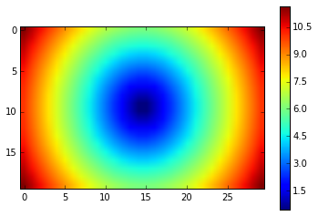


    # Horizontal Colorbar
    plt.imshow(z)
    plt.colorbar(orientation='horizontal', shrink=0.75)  # We can make colorbars do all sorts of things!
    plt.show()


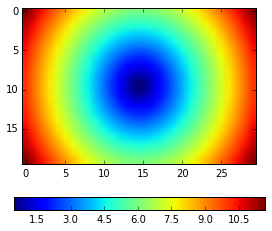


    # Change colorbar shape
    plt.imshow(z)
    cbar = plt.colorbar(extend='both', aspect=10)
    cbar.set_label('distance')                           # And we can even add a label to it
    plt.show()


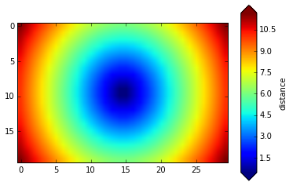


## Colors
This is, perhaps, the most important piece of vocabulary in matplotlib. Given that matplotlib is a plotting library, colors are associated with everything that is plotted in your figures. Matplotlib supports a [very robust language](http://matplotlib.org/api/colors_api.html#module-matplotlib.colors) for specifying colors that should be familiar to a wide variety of users.

### Colornames
First, colors can be given as strings. For very basic colors, you can even get away with just a single letter:

- b: blue
- g: green
- r: red
- c: cyan
- m: magenta
- y: yellow
- k: black
- w: white

Other colornames that are allowed are the HTML/CSS colornames such as "burlywood" and "chartreuse" are valid. See the [full list](http://www.w3schools.com/html/html_colornames.asp) of the 147 colornames. For the British speaking and poor spellers among us (Note, I am not implying that British speakers are poor spellers!), we allow "grey" where-ever "gray" appears in that list of colornames. All of these colornames are case-insensitive.

### Hex values
Colors can also be specified by supplying an HTML/CSS hex string, such as `'#0000FF'` for blue.

### 256 Shades of Gray
A gray level can be given instead of a color by passing a string representation of a number between 0 and 1, inclusive. `'0.0'` is black, while `'1.0'` is white. `'0.75'` would be a lighter shade of gray.

### RGB[A] tuples
You may come upon instances where the previous ways of specifying colors do not work. This can sometimes happen in some of the deeper, stranger levels of the code. When all else fails, the universal language of colors for matplotlib is the RGB[A] tuple. This is the "Red", "Green", "Blue", and sometimes "Alpha" tuple of floats in the range of [0, 1]. One means full saturation of that channel, so a red RGBA tuple would be `(1.0, 0.0, 0.0, 1.0)`, whereas a partly transparent green RGBA tuple would be `(0.0, 1.0, 0.0, 0.75)`.  The documentation will usually specify whether it accepts RGB or RGBA tuples. Sometimes, a list of tuples would be required for multiple colors, and you can even supply a Nx3 or Nx4 numpy array in such cases.

In functions such as `plot()` and `scatter()`, while it may appear that they can take a color specification, what they really need is a "format specification", which includes color as part of the format. Unfortunately, such specifications are string only and so RGB[A] tuples are not supported for such arguments (but you can still pass an RGB[A] tuple for a "color" argument).

Note, oftentimes there is a separate argument for "alpha" where-ever you can specify a color. The value for "alpha" will usually take precedence over the alpha value in the RGBA tuple. There is no easy way around this problem.


# Markers
[`Markers`](http://matplotlib.org/api/markers_api.html) are commonly used in [`plot()`](http://matplotlib.org/api/pyplot_api.html#matplotlib.pyplot.plot) and [`scatter()`](http://matplotlib.org/api/pyplot_api.html#matplotlib.pyplot.scatter) plots, but also show up elsewhere. There is a wide set of markers available, and custom markers can even be specified.

marker     |  description  ||marker    |  description  ||marker    |  description  ||marker    |  description  
:----------|:--------------||:---------|:--------------||:---------|:--------------||:---------|:--------------
"."        |  point        ||"+"       |  plus         ||","       |  pixel        ||"x"       |  cross
"o"        |  circle       ||"D"       |  diamond      ||"d"       |  thin_diamond ||          |
"8"        |  octagon      ||"s"       |  square       ||"p"       |  pentagon     ||"\*"      |  star
"&#124;"   |  vertical line||"\_"      | horizontal line ||"h"     |  hexagon1     ||"H"       |  hexagon2
0          |  tickleft     ||4         |  caretleft    ||"<"       | triangle_left ||"3"       |  tri_left
1          |  tickright    ||5         |  caretright   ||">"       | triangle_right||"4"       |  tri_right
2          |  tickup       ||6         |  caretup      ||"^"       | triangle_up   ||"2"       |  tri_up
3          |  tickdown     ||7         |  caretdown    ||"v"       | triangle_down ||"1"       |  tri_down
"None"     |  nothing      ||`None`    |  nothing      ||" "       |  nothing      ||""        |  nothing


    xs, ys = np.mgrid[:4, 9:0:-1]
    markers = [".", "+", ",", "x", "o", "D", "d", "", "8", "s", "p", "*", "|", "_", "h", "H", 0, 4, "<", "3",
               1, 5, ">", "4", 2, 6, "^", "2", 3, 7, "v", "1", "None", None, " ", ""]
    descripts = ["point", "plus", "pixel", "cross", "circle", "diamond", "thin diamond", "",
                 "octagon", "square", "pentagon", "star", "vertical bar", "horizontal bar", "hexagon 1", "hexagon 2",
                 "tick left", "caret left", "triangle left", "tri left", "tick right", "caret right", "triangle right", "tri right",
                 "tick up", "caret up", "triangle up", "tri up", "tick down", "caret down", "triangle down", "tri down",
                 "Nothing", "Nothing", "Nothing", "Nothing"]
    fig, ax = plt.subplots(1, 1, figsize=(14, 4))
    for x, y, m, d in zip(xs.T.flat, ys.T.flat, markers, descripts):
        ax.scatter(x, y, marker=m, s=100)
        ax.text(x + 0.1, y - 0.1, d, size=14)
    ax.set_axis_off()
    plt.show()


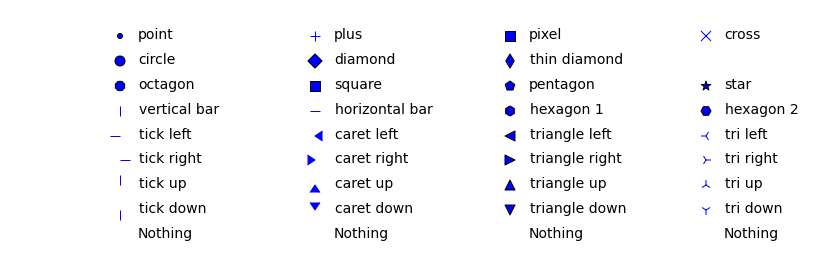


## Linestyles
Line styles are about as commonly used as colors. There are a few predefined linestyles available to use. Note that there are some advanced techniques to specify some custom line styles. [`Here`](http://matplotlib.org/1.3.0/examples/lines_bars_and_markers/line_demo_dash_control.html) is an example of a custom dash pattern.

linestyle          | description
-------------------|------------------------------
'-'                | solid
'--'               | dashed
'-.'               | dashdot
':'                | dotted
'None'             | draw nothing
' '                | draw nothing
''                 | draw nothing

Also, don't mix up ".-" (line with dot markers) and "-." (dash-dot line) when using the plot or scatter functions.


    t = np.arange(0.0, 5.0, 0.2)
    plt.plot(t, t, '-', t, t**2, '--', t, t**3, '-.', t, -t, ':')
    plt.show()


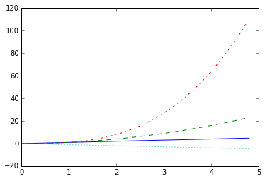


It is a bit confusing, but the line styles mentioned above are only valid for lines. Whenever you are dealing with the linestyles of the edges of "Patch" objects, you will need to use words instead of the symbols. So "solid" instead of "-", and "dashdot" instead of "-.". Hopefully, this issue will be fixed for the v1.5 release and allow these specifications to be used interchangably.


    fig, ax = plt.subplots(1, 1)
    ax.bar([1, 2, 3, 4], [10, 20, 15, 13], ls='dashed', ec='r', lw=5)
    plt.show()


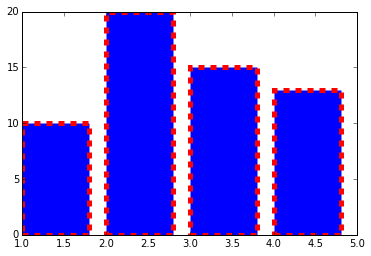


## Plot attributes
With just about any plot you can make, there are many attributes that can be modified to make the lines and markers suit your needs. Note that for many plotting functions, matplotlib will cycle the colors for each dataset you plot. However, you are free to explicitly state which colors you want used for which plots. For the [`plt.plot()`](http://matplotlib.org/api/pyplot_api.html#matplotlib.pyplot.plot) and [`plt.scatter()`](http://matplotlib.org/api/pyplot_api.html#matplotlib.pyplot.scatter) functions, you can mix the specification for the colors, linestyles, and markers in a single string.


    t = np.arange(0., 5., 0.2)
    # red dashes, blue squares and green triangles
    plt.plot(t, t, 'r--', t, t**2, 'bs', t, t**3, 'g^')
    plt.show()


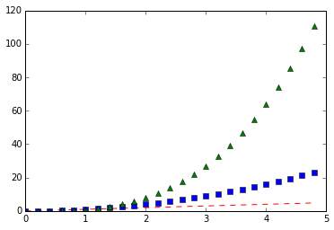


| Property               | Value Type                                      
|------------------------|-------------------------------------------------
|alpha                   | float                                           
|color or c              | any matplotlib color                            
|dash_capstyle           | ['butt', 'round' 'projecting']               
|dash_joinstyle          | ['miter' 'round' 'bevel']
|dashes                  | sequence of on/off ink in points                
|drawstyle               | [ ‘default’ ‘steps’ ‘steps-pre’
|                        |   ‘steps-mid’ ‘steps-post’ ]
|linestyle or ls         | [ '-' '--' '-.' ':' 'None' ' ' ''] 
|                        | and any drawstyle in combination with a         
|                        | linestyle, e.g. 'steps--'.                      
|linewidth or lw         | float value in points                           
|marker                  | [ 0 1 2 3 4 5 6 7 'o' 'd' 'D' 'h' 'H'
|                        |  '' 'None' ' ' `None` '8' 'p' ','
|                        |  '+' 'x' '.' 's' '\*' '\_' '&#124;'
|                        |  '1' '2' '3' '4' 'v' '<' '>' '^' ]
|markeredgecolor or mec  | any matplotlib color
|markeredgewidth or mew  | float value in points
|markerfacecolor or mfc  | any matplotlib color
|markersize or ms        | float
|solid_capstyle          | ['butt' 'round' 'projecting']
|solid_joinstyle         | ['miter' 'round' 'bevel']
|visible                 | [`True` `False`]
|zorder                  | any number

## Mathtext
Oftentimes, you just simply need that superscript or some other math text in your labels. Matplotlib provides a very easy way to do this for those familiar with LaTeX. Any text that is surrounded by dollar signs will be treated as "[`mathtext`](http://matplotlib.org/users/mathtext.html#mathtext-tutorial)". Do note that because backslashes are prevelent in LaTeX, it is often a good idea to prepend an `r` to your string literal so that Python will not treat the backslashes as escape characters.


    plt.scatter([1, 2, 3, 4], [4, 3, 2, 1])
    plt.title(r'$\sigma_i=15$', fontsize=20)
    plt.show()


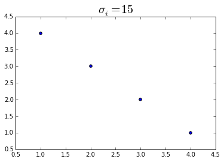


## Annotations and Arrows
There are two ways one can place arbitrary text anywhere they want on a plot. The first is a simple [`text()`](http://matplotlib.org/api/pyplot_api.html#matplotlib.pyplot.text).  Then there is the fancier [`annotate()`](http://matplotlib.org/api/pyplot_api.html#matplotlib.pyplot.annotate) function that can help "point out" what you want to annotate.


    t = np.arange(0.0, 5.0, 0.01)
    s = np.cos(2*np.pi*t)
    plt.plot(t, s, lw=2)
    
    plt.annotate('local max', xy=(2, 1), xytext=(3, 1.5),
                 arrowprops=dict(facecolor='black', shrink=0.05))
    
    plt.ylim(-2, 2)
    plt.show()


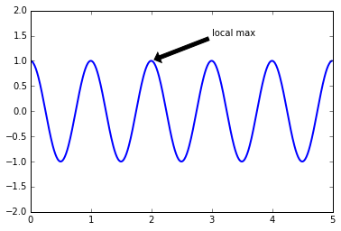


There are all sorts of boxes for your text, and arrows you can use, and there are many different ways to connect the text to the point that you want to annotate. For a complete tutorial on this topic, go to the [`Annotation Guide`](http://matplotlib.org/users/annotations_guide.html).

## Hatches
A Patch object can have a hatching defined for it.

* /   - diagonal hatching
* \   - back diagonal
* |   - vertical
* \-   - horizontal
* \+   - crossed
* x   - crossed diagonal
* o   - small circle
* O   - large circle (upper-case 'o')
* .   - dots
* \*   - stars
     
Letters can be combined, in which case all the specified
hatchings are done.  If same letter repeats, it increases the
density of hatching of that pattern.


    bars = plt.bar([1, 2, 3, 4], [10, 12, 15, 17])
    plt.setp(bars[0], hatch='x', facecolor='w')
    plt.show()


## Now that we know some basics on Matplotlib, lets play with an example.

## Sine Cosine Plot
In this section we will calculate cosine and sine values for a range of values and draw them on the same plot.
Fire up your ipython terminal with command line argument `--pylab`
pylab is a magic function for ipython which will basically make following calls behind the scenes for us:
```
import numpy
import matplotlib
from matplotlib import pylab, mlab, pyplot
np = numpy
plt = pyplot

from IPython.display import display
from IPython.core.pylabtools import figsize, getfigs

from pylab import *
from numpy import *
```


    import pylab as pl
    import numpy as np
    # If you are using Ipython, you do not have to type this. If you are using Ipython notebook or Jupyter,
    # this next line will help generate plots inside the browser window instead of in a separate "pop up"
    %matplotlib inline


    n = np.linspace(-np.pi, np.pi, 256, endpoint=True)
    co, si = np.cos(n), np.sin(n)


    pl.plot(n, co)
    pl.plot(n, si)
    pl.show()


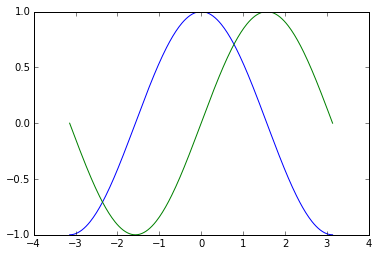


Now lets look at the default settings and try changing some parameters that will influence the appearance of the plot.

### Controlling line properties

Lines have many attributes that you can set: `linewidth`, `dash style`, `antialiased`, etc; see [`matplotlib.lines.Line2D`](http://matplotlib.org/api/lines_api.html#matplotlib.lines.Line2D 'MPL 2D Lines'). There are several ways to set line properties. We will use keyword args:

`pl.plot(n, co, color='red', linewidth=2.0, linestyle='-', marker='+')`

`pl.plot(n, si, color='#9A69FC', linestyle=':', marker=',')`

You can use color names to set the color of the line or you can use the hex code.


    pl.plot(n, co, color='red', linewidth=2.0, linestyle='-')
    pl.plot(n, si, color='#9A69FC', linewidth=2.0, linestyle='--')
    pl.show()


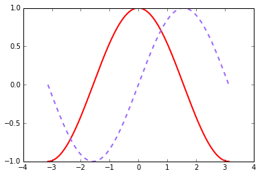


There are many more line properties that you can change. Check [`complete list of properties`](http://matplotlib.org/users/pyplot_tutorial.html#controlling-line-properties 'Controlling Line Properties')

### Setting Limits
Current limits of the figure are a bit too tight and the amplitude part is getting clipped. Now lets make some space in order to clearly see all data points.


    pl.xlim(n.min() * 1.1, n.max() * 1.1)  # set the xlim between n.min()*1.1 and n.max()*1.1
    pl.ylim(co.min() * 1.1, co.max() * 1.1)
    pl.plot(n, co, color='red', linewidth=1.0, linestyle='-', label='Cosine Function')
    pl.plot(n, si, color='#9A69FC', linewidth=1.0, linestyle='--', label='Sine Function')
    pl.show()


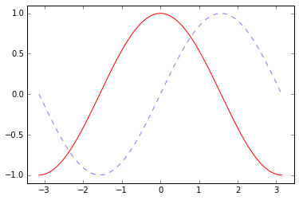


Setting limits turns autoscaling off for the x-axis.

If you do not specify args, you can pass the xmin and xmax as kwargs, e.g.:

`pl.xlim(xmax=n.max()*1.1)` # adjust the max leaving min unchanged

`pl.xlim(xmin=n.min()*1.1)` # adjust the min leaving max unchanged

### Setting Ticks
Current ticks are not ideal because they do not show the interesting values (+/-π,+/-π/2) for sine and cosine. Let's change them such that they show only these values.


    pl.plot(n, co, color='red', linewidth=1.0, linestyle='-', label='Cosine Fn')
    pl.plot(n, si, color='#9A69FC', linewidth=1.0, linestyle='--', label='Sine Fn')
    pl.xticks([-np.pi, -np.pi/2, 0, np.pi/2, np.pi], rotation=30)  # set the location and orientation of the xticks
    pl.yticks([-1, 0, +1])  # set the locations of the yticks
    pl.show()


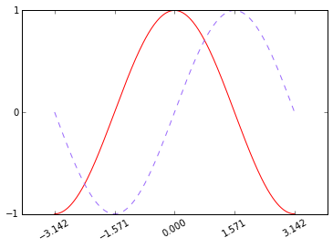


The keyword args, if any, are [Text](http://matplotlib.org/api/text_api.html#matplotlib.text.Text 'Text Properties') properties. 

For example, if the xticks are some long values, you can rotate them so that they do not overlap.

### Adding a Legend
Let’s add a legend in the upper left corner. This only requires adding the keyword argument label (that will be used in the legend box) to the plot commands.


    pl.plot(n, co, color="red", linewidth=1, linestyle="-", label="cosine Fn")
    pl.plot(n, si, color="#9A69FC",  linewidth=1, linestyle="--", label="sine Fn")
    pl.xlim(n.min() * 1.1, n.max() * 1.1)  # Setting xlim
    pl.ylim(co.min() * 1.1, co.max() * 1.1) # Setting ylim
    pl.xticks([-np.pi, -np.pi/2, 0, np.pi/2, np.pi], rotation=30)  # Setting xticks
    pl.yticks([-1, 0, +1])  # set the locations of the yticks  # Setting yticks
    
    pl.legend(loc='upper left')
    pl.show()


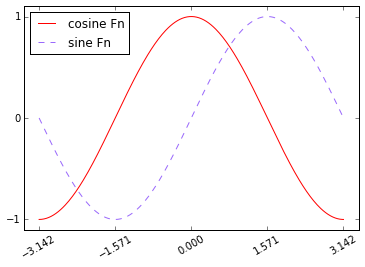


### Moving Spines
Spines are the lines connecting the axis tick marks and noting the boundaries of the data area. They can be placed at arbitrary positions and until now, they were on the border of the axis. We'll change that since we want to have them in the middle. Since there are four of them (top/bottom/left/right), we'll discard the top and right by setting their color to none and we'll move the bottom and left ones to coordinate 0 in data space coordinates.


    pl.xlim(n.min() * 1.1, n.max() * 1.1)  # Setting xlim
    pl.ylim(co.min() * 1.1, co.max() * 1.1) # Setting ylim
    pl.xticks([-np.pi, -np.pi/2, 0, np.pi/2, np.pi], rotation=30)  # Setting xticks
    pl.yticks([-1, 0, +1])  # set the locations of the yticks  # Setting yticks
    
    pl.plot(n, co, color="red", linewidth=1, linestyle="-", label="cosine Fn")
    pl.plot(n, si, color="#9A69FC",  linewidth=1, linestyle="--", label="sine Fn")
    
    ax = pl.gca()  # gca stands for 'get current axis'
    ax.spines['right'].set_color('none')  # hide 
    ax.spines['top'].set_color('none')
    ax.xaxis.set_ticks_position('bottom')
    ax.spines['bottom'].set_position(('data',0))
    ax.yaxis.set_ticks_position('left')
    ax.spines['left'].set_position(('data',0))
    
    pl.legend(loc='upper left')
    pl.show()


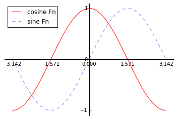


### Setting tick labels
Ok, so far so good. Now we look at this plot and the values on the x-axis does not appeal us. We could guess that 3.142 means $\pi$ but we are used to seeing x axis ranging from $-\pi$ and $\pi$ on such plots.

>Note that we’ll use $\LaTeX$ to allow for nice rendering of the label.


    pl.xlim(n.min() * 1.1, n.max() * 1.1)  # Setting xlim
    pl.ylim(co.min() * 1.1, co.max() * 1.1) # Setting ylim
    
    # when we set tick values, we can also provide 
    # a corresponding label in the second argument list.
    # So the tick values will be replaced by the latex labels.
    pl.xticks([-np.pi, -np.pi/2, 0, np.pi/2, np.pi],
              [r'$-\pi$', r'$-\pi/2$', r'$0$', r'$+\pi/2$', r'$+\pi$'])
    
    # We don't like 0 being printed for both x and y axis.
    # insted we will just keep x's 0
    pl.yticks([-1, 0, +1],
              [r'$-1$', '', r'$+1$'])
    
    pl.plot(n, co, color="red", linewidth=1, linestyle="-", label="cosine Fn")
    pl.plot(n, si, color="#9A69FC",  linewidth=1, linestyle="--", label="sine Fn")
    
    ax = pl.gca()  # gca stands for 'get current axis'
    ax.spines['right'].set_color('none')          # hide right spine
    ax.spines['top'].set_color('none')            # hide top spine
    ax.xaxis.set_ticks_position('bottom')         # set ticks position to bottom spine
    ax.spines['bottom'].set_position(('data',0))  # set bottom spine at position 0
    ax.yaxis.set_ticks_position('left')
    ax.spines['left'].set_position(('data',0))    # set left spine at position 0
    
    pl.legend(loc='upper left')
    pl.show()


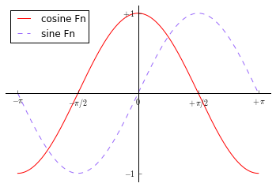


### Annotate
Let’s annotate some interesting points using the annotate command. We chose the 2π/3 value and we want to annotate both the sine and the cosine. We’ll first draw a marker on the curve as well as a straight dotted line. Then, we’ll use the annotate command to display some text with an arrow.


    pl.xlim(n.min() * 1.1, n.max() * 1.1)  # Setting xlim
    pl.ylim(co.min() * 1.1, co.max() * 1.1) # Setting ylim
    
    # when we set tick values, we can also provide 
    # a corresponding label in the second argument list.
    # So the tick values will be replaced by the latex labels.
    pl.xticks([-np.pi, -np.pi/2, 0, np.pi/2, np.pi],
              [r'$-\pi$', r'$-\pi/2$', r'$0$', r'$+\pi/2$', r'$+\pi$'])
    
    # We don't like 0 being printed for both x and y axis.
    # insted we will just keep x's 0
    pl.yticks([-1, 0, +1],
              [r'$-1$', '', r'$+1$'])
    
    pl.plot(n, co, color="red", linewidth=1, linestyle="-", label="cosine Fn")
    pl.plot(n, si, color="#9A69FC",  linewidth=1, linestyle="--", label="sine Fn")
    
    
    # Plot the line where value of cos is 2pi/3
    t = 2 * np.pi / 3
    pl.plot([t, t], [0, np.cos(t)], color='red', linewidth=2.5, linestyle="--")
    pl.scatter([t, ], [np.cos(t), ], 50, color='red')
    
    # Annotate using LaTeX fonts.
    pl.annotate(r'$sin(\frac{2\pi}{3})=\frac{\sqrt{3}}{2}$',
                xy=(t, np.sin(t)), xycoords='data',
                xytext=(+10, +30), textcoords='offset points', fontsize=16,
                arrowprops=dict(arrowstyle="->", connectionstyle="arc3,rad=.2"))
    
    # Plot the line where value of sin is 2pi/3
    pl.plot([t, t],[0, np.sin(t)], color='#9A69FC', linewidth=2.5, linestyle="--")
    pl.scatter([t, ],[np.sin(t), ], 50, color='#9A69FC')
    
    pl.annotate(r'$cos(\frac{2\pi}{3})=-\frac{1}{2}$',
                xy=(t, np.cos(t)), xycoords='data',
                xytext=(-90, -50), textcoords='offset points', fontsize=16,
                arrowprops=dict(arrowstyle="->", connectionstyle="arc3,rad=.2"))
    
    ax = pl.gca()  # gca stands for 'get current axis'
    ax.spines['right'].set_color('none')          # hide right spine
    ax.spines['top'].set_color('none')            # hide top spine
    ax.xaxis.set_ticks_position('bottom')         # set ticks position to bottom spine
    ax.spines['bottom'].set_position(('data',0))  # set bottom spine at position 0
    ax.yaxis.set_ticks_position('left')
    ax.spines['left'].set_position(('data',0))    # set left spine at position 0
    
    pl.legend(loc='upper left')
    
    pl.show()


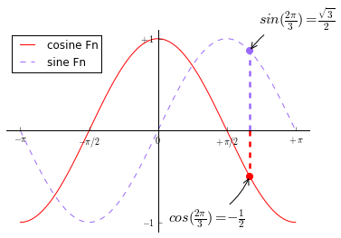


### Bbox
Everything looks almost perfect.. except for one small thing. The tick labels are hardly visible.

We can make them bigger and we can also adjust their properties such that they’ll be rendered on a semi-transparent white background. This will allow us to see both the data and the labels.


    pl.xlim(n.min() * 1.1, n.max() * 1.1)  # Setting xlim
    pl.ylim(co.min() * 1.1, co.max() * 1.1) # Setting ylim
    
    # when we set tick values, we can also provide 
    # a corresponding label in the second argument list.
    # So the tick values will be replaced by the latex labels.
    pl.xticks([-np.pi, -np.pi/2, 0, np.pi/2, np.pi],
              [r'$-\pi$', r'$-\pi/2$', r'$0$', r'$+\pi/2$', r'$+\pi$'])
    
    # We don't like 0 being printed for both x and y axis.
    # insted we will just keep x's 0
    pl.yticks([-1, 0, +1],
              [r'$-1$', '', r'$+1$'])
    
    pl.plot(n, co, color="red", linewidth=1, linestyle="-", label="cosine Fn")
    pl.plot(n, si, color="#9A69FC",  linewidth=1, linestyle="--", label="sine Fn")
    
    
    # Plot the line where value of cos is 2pi/3
    t = 2 * np.pi / 3
    pl.plot([t, t], [0, np.cos(t)], color='red', linewidth=2.5, linestyle="--")
    pl.scatter([t, ], [np.cos(t), ], 50, color='red')
    
    pl.annotate(r'$sin(\frac{2\pi}{3})=\frac{\sqrt{3}}{2}$',
                xy=(t, np.sin(t)), xycoords='data',
                xytext=(+10, +30), textcoords='offset points', fontsize=16,
                arrowprops=dict(arrowstyle="->", connectionstyle="arc3,rad=.2"))
    
    # Plot the line where value of sin is 2pi/3
    pl.plot([t, t],[0, np.sin(t)], color='#9A69FC', linewidth=2.5, linestyle="--")
    pl.scatter([t, ],[np.sin(t), ], 50, color='#9A69FC')
    
    pl.annotate(r'$cos(\frac{2\pi}{3})=-\frac{1}{2}$',
                xy=(t, np.cos(t)), xycoords='data',
                xytext=(-90, -50), textcoords='offset points', fontsize=16,
                arrowprops=dict(arrowstyle="->", connectionstyle="arc3,rad=.2"))
    
    ax = pl.gca()  # gca stands for 'get current axis'
    ax.spines['right'].set_color('none')          # hide right spine
    ax.spines['top'].set_color('none')            # hide top spine
    ax.xaxis.set_ticks_position('bottom')         # set ticks position to bottom spine
    ax.spines['bottom'].set_position(('data',0))  # set bottom spine at position 0
    ax.yaxis.set_ticks_position('left')
    ax.spines['left'].set_position(('data',0))    # set left spine at position 0
    
    pl.legend(loc='upper left')
    
    # Increase font size for x and y tick labels and set the facecolor as 
    # same color as our background
    for label in ax.get_xticklabels() + ax.get_yticklabels():
        label.set_fontsize(16)
        label.set_bbox(dict(facecolor='white', edgecolor='None', alpha=0.65))
    
    pl.show()


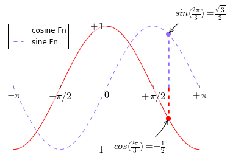

